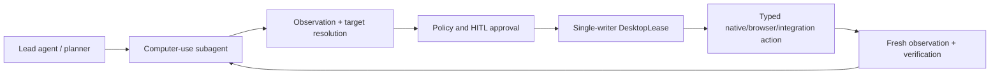

# VILAGENT Architecture

VILAGENT is the computer-use specialization being built inside the VILAGENT
repository. It preserves VILAGENT's lead-agent and subagent orchestration while
replacing the broad deep-research execution surface with a policy-controlled
Windows desktop execution plane.

## Current Phase

The current implementation is an isolated harness package at
`packages/harness/vilagent/computer_use`. Windows mutation remains narrowly
restricted:

- screen observations are captured through Pillow and stored outside LangGraph
  state;
- observations include read-only foreground-window identity metadata;
- semantic Windows controls are queried through pywinauto UI Automation;
- logical desktop sessions own bounded observation history and a single-writer
  desktop lease;
- typed actions pass through policy, approval, execution, and postcondition
  verification contracts;
- `WindowsAgentHost` combines sessions, a fail-closed emergency-stop latch,
  persistent audit, UIA discovery, and host-wrapped actions;
- semantic UIA invoke/focus exists, but the default allowlist permits only
  `focus_window`;
- typed actions are stored with owner identity and immutable fingerprints;
- enabled hosts atomically persist action, approval, idempotency, and sanitized
  lifecycle-event state for restart recovery;
- owner-scoped idempotency prevents duplicate action submission on retries;
- configured total-action budgets are enforced per exact thread/run/agent
  owner, including across restored lifecycle state;
- the first accepted action binds a desktop session ID to its exact action
  owner; other owners cannot submit actions to that session;
- high-risk actions wait in a one-time approval lifecycle before execution;
- internal execution accepts only the ID of an approved stored action;
- bounded, sanitized lifecycle events support incremental operator polling;
- condition-backed event waiting supports bounded low-cost operator long-poll;
- resumable internal SSE streams expose the same sanitized lifecycle contract;
- provider-neutral target resolution prefers app/browser/UIA before vision;
- the Windows host resolves unique semantic UIA targets against the latest
  stored observation;
- routed verification supports screen change and semantic UIA existence
  conditions while unknown conditions fail closed;
- provider-neutral desktop safety state blocks mutation on locked, secure,
  unavailable, or unknown desktop state;
- the default Windows desktop safety provider reads the active input desktop
  through Win32 off the event loop and fails closed on non-default or
  unreadable desktop state;
- typed host health combines desktop safety and emergency-stop state;
- enabled hosts must register the configured global Windows emergency-stop
  hotkey during startup; registration/listener failures block startup;
- enabled hosts also own a loopback-only authenticated IPC control plane;
  Gateway heartbeat loss makes the host heartbeat stale and blocks mutation;
- Gateway startup does not expose an enabled host until the first
  authenticated IPC heartbeat succeeds;
- a fail-closed process-supervisor contract terminates a child on process or
  heartbeat failure and forbids automatic restart before reconciliation;
- a spawn-safe Windows child entrypoint now constructs its own host, exchanges
  a one-time typed pipe handshake, and serves authenticated loopback
  heartbeat/health; live Windows spawn and supervision tests pass;
- Gateway health, desktop session lifecycle, observation, target resolution,
  read-only UIA discovery, sanitized audit/lifecycle reads, approvals, action
  submit/cancel/execute, emergency stop, and browser health/session lifecycle
  now consume a narrow typed remote host facade;
- no physical mouse or keyboard input provider is connected.

## Execution Model

Planners should prefer the cheapest reliable targeting strategy in this order:
application integrations, browser DOM, UI Automation, remote vision model, and
finally guarded coordinates. A target is valid only for the observation that
created it, or for an immediately following observation proven unchanged.
`TargetResolver` enforces the first four strategies in that order by default;
coordinate resolution must be explicitly enabled per query. It rejects stale,
low-confidence, and provider-strategy-mismatched candidates.

## Package Boundaries

- `models.py`: checkpoint-friendly action, observation, target, policy, and
  session contracts.
- `providers.py`: protocols for observation, action, verification, and HITL.
- `engine.py`: provider-neutral observe-action-verify loop.
- `lease.py`: process-local single-writer desktop mutation lease.
- `observation_store.py`: metadata and binary observations kept outside agent
  checkpoints; includes an independently tested atomic JSON/blob store that
  validates blob size and SHA-256 on restart. The dedicated Windows session
  bootstrap uses session-scoped persistent stores and restores latest metadata.
  History/age eviction removes complete observation records before deleting
  unreferenced blobs; startup also removes orphan and interrupted temporary
  blobs/snapshots. Published malformed metadata and referenced blob integrity
  failures remain fail-closed. Blob IDs are restricted to store-generated hex
  identifiers.
- Each dedicated session store has an independent persistent byte quota.
  Quota pressure preserves the new observation and evicts oldest complete
  records plus orphan blobs; an observation that cannot fit by itself is
  rejected without publishing metadata or leaving an orphan blob.
- Raw blobs remain available only to child-local observation/verification
  providers. The store's export boundary requires the exact referencing
  observation and `redaction_applied=true`; unredacted and unrelated blobs are
  denied before any future IPC/Gateway retrieval contract.
- Typed IPC can authorize export metadata only after the exact owner has at
  least one lifecycle action bound to the requested session and the child
  export gate validates the exact observation/blob/redaction relationship.
  Missing, unbound, wrong-owner, unrelated, and unredacted requests share a
  sanitized not-found response. Binary transfer uses a separate raw loopback
  frame after a typed JSON header; the remote client validates exact length and
  SHA-256 before Gateway returns the payload. Screenshot bytes never enter JSON,
  lifecycle state, checkpoints, or model messages.
- The child additionally enforces per-transfer byte limits, global concurrent
  export limits, and per-owner rolling-minute rates. Successful and blocked
  exports are audited; audit failure blocks successful data release.
- When `redact_sensitive_regions=true`, Windows bootstrap uses a fail-closed
  UIA password-field redactor. It masks controls explicitly marked
  `is_password`; if UIA sensitive-region enumeration fails, observation capture
  fails and no blob is marked exportable. Other sensitive-data classes require
  future explicit detectors and are not silently claimed as covered.
- `action_store.py`: owner-bound action lifecycle and one-time approval queue.
  Includes in-memory and atomic JSON snapshot backends.
- `lifecycle_events.py`: ordered, bounded, owner-filtered lifecycle event store.
- `orchestration.py`: policy-based submission and approved snapshot execution.
- `target_resolver.py`: cost-aware provider routing and candidate validation.
- `verification.py`: routed and conservative fail-closed verification.
- `session.py`: local desktop session lifecycle and provider health.
- `safety.py`: emergency-stop and mandatory host action wrapper.
- `audit.py`: per-session JSONL mutation audit with blocking I/O offloaded.
- `windows/`: screen/UIA adapters, Win32 desktop-safety detection, semantic
  action provider, and Agent Host.
- `config/computer_use_config.py`: feature gate, budgets, retention, and
  Windows runtime settings.
- `app/gateway/routers/computer_use.py`: internal-only host management,
  approval, typed submission, and approved-action execution API.

The harness package never imports `app.*`. Future Gateway APIs and the Electron
frontend must depend on these contracts, not the reverse.

## Safety Invariants

- Computer use is disabled by default.
- High-risk actions require HITL approval; critical actions are denied by the
  default policy.
- All desktop-mutating actions must hold the desktop lease.
- Every action must use a fresh target and be followed by a fresh observation.
  After policy/approval and desktop-lease acquisition, an additional immediate
  observation must prove the desktop, expected foreground, and preconditions
  are still valid before any native provider is called.
- Browser automation is opt-in and adapter-driven. Exact allowed-domain policy,
  exact-owner browser sessions, current DOM targets, required postconditions,
  and central lifecycle/allowlist controls are mandatory. Provider order is
  integration/app -> browser/DOM -> UIA -> vision -> explicit coordinate.
- Browser runtime integration uses `BrowserRuntimePort`, keeping browser-use as
  an adapter detail outside core models. The port covers browser state capture,
  DOM resolution, browser action execution, and DOM/domain verification.
- `browser_use_runtime.py` provides the optional browser-use adapter. It is
  import-safe without browser-use installed, reports
  `browser_use_not_installed` instead of crashing, and is enabled through the
  `computer-use-browser` package extra. `WindowsAgentHost` auto-creates it
  only when browser config is enabled and no explicit test/runtime injection is
  supplied.
- Browser tab lifecycle is owner-scoped: create is domain-gated, returned tab
  state is revalidated, list/close is exact-owner filtered, and browser health
  does not grant action permission.
- Browser health/create/list/close are exposed through typed child IPC and the
  internal Gateway API. Browser action execution remains a separate opt-in
  action kind behind `computer_use.host_safety.allowed_actions` and the same
  domain policy.
- Browser state can be attached to a desktop observation only at the host
  boundary, and only when the caller supplies both exact owner identity and an
  owned browser session ID. The desktop session service remains browser-agnostic.
- Browser-aware target resolution uses the same owner/browser session context
  to capture a fresh enriched observation before `TargetResolver` runs. This
  lets browser DOM resolve before UIA without persisting browser state into the
  desktop session service.
- Gateway exposes body-based browser observe/target-resolution endpoints for
  operator/front-end clients so the exact owner plus browser session context
  travels as one typed JSON payload.
- Browser action construction is separated from execution. Gateway can submit
  a stored `browser_action` from a resolved browser target and owned allowed
  browser state, but the action still passes through lifecycle policy,
  postconditions, approval, and host action allowlist before execution.
- `WindowsPhysicalInputProvider` exists only as an isolated gated provider. It
  is disabled by default, supports bounded coordinate click only, and is absent
  from the default host allowlist. Its Win32 `SendInput` backend is reachable
  only when both explicit physical-input config and action allowlist gates are
  enabled. Semantic UIA targets never silently fall back to coordinate input.
- Coordinate clicks require explicit approval regardless of caller-provided
  risk level. The physical provider yields for cancellation and calls a
  host-owned injection guard immediately before `SendInput`; emergency stop,
  unsafe desktop, unhealthy control plane, or guard failure blocks injection.
- Durable approved physical actions remain approved after restart and never
  auto-execute. A host restart during execution reconciles the immutable
  owner-bound snapshot to `uncertain`.
- Coordinate click admission also requires at least one explicit postcondition.
  The action service owns running execution tasks, so owner-scoped cancel
  requests interrupt the task and persist a terminal cancelled lifecycle state.
- When a target declares `expected_window`, the engine verifies the foreground
  window before preconditions or mutation and blocks mismatches.
- UIA target resolution fails closed on ambiguous, invisible, or disabled
  matches and emits selectors compatible with the stable semantic UIA action
  resolver.
- Screenshots and future UI trees stay out of LLM messages and LangGraph
  checkpoints unless explicitly summarized or selected.
- Provider failures produce structured errors and degrade session health.
- Mutation is blocked if its request audit cannot be persisted.
- Audit records contain argument keys, never raw argument values or typed text.
- Emergency stop is checked both before and immediately after request audit.
- Desktop safety is checked both before and immediately after request audit;
  safety-provider failure blocks mutation.
- Enabled-host control-plane heartbeat is checked before and immediately after
  request audit; starting, stale, or stopped heartbeat blocks mutation.
- Engines created by the host are bound to one session and its desktop lease.
- Execution requests never accept replacement action payloads; they reference
  the immutable stored action by ID and exact thread/run/agent owner.
- Reusing an idempotency key with the same semantic action returns the existing
  lifecycle record; reusing it with a different payload fails closed.
- Same-owner submissions are serialized for deterministic budget admission;
  excess actions are stored as denied with `action_budget_exhausted`.
- Session admission is serialized so concurrent first submissions cannot bind
  one desktop session to multiple owners.
- A host restart never retries an `executing` action. It reconciles the action
  to terminal `uncertain` with `host_restart_during_execution`.
- Corrupt or unsupported lifecycle snapshots block enabled-host startup.
- Enabled default hosts atomically claim the lifecycle path before loading
  durable state. A second, stale, corrupt, or replaced claim blocks startup
  fail-closed and requires explicit operator reconciliation.
- Clean shutdown releases lifecycle ownership only after verifying the claim
  identity. Claim metadata contains no IPC token or action payload.
- `computer_use.runtime_mode=dedicated_process` makes the supervised child the
  sole host runtime owner. Gateway does not create an in-process host in this
  mode; all Gateway computer-use routes use typed authenticated child IPC.
- Remote owner-scoped lifecycle reads include sanitized event polling and
  exact-owner action lookup. Missing and different-owner action lookup share
  the same not-found result.
- Bounded remote lifecycle wait supports long-poll and Gateway-framed SSE.
  Waits are capped at 30 seconds, use a one-second transport grace, and retain
  the same sanitized owner-filtered event contract.
- Approval lookup/listing are state-changing reconciliation operations because
  they can expire approvals and persist denial. They now run in the exclusive
  child together with approve/deny.
- Session create/stop/delete, observation capture, target resolution, and
  action submit/cancel/execute also run through typed child IPC.
- Browser health and tab lifecycle also run through typed child IPC. Create is
  URL allowlist gated and revalidates the runtime-returned URL; list and close
  are exact-owner scoped.
- Spawned-child screenshot capture uses Win32 GDI from a capture worker
  attached to the active input desktop and passes live observation/target
  tests.
- Lifecycle persistence failures block state-changing action/approval requests
  and surface as service unavailable.
- Approval decisions are one-time, expire fail-closed, and cannot alter action
  payloads.
- Lifecycle events expose IDs, ownership, status, action kind, and error codes
  only; they never expose action args, selectors, typed text, or approval text.
- Unknown verification conditions fail closed.
- UIA verification supports only `uia_element` with `exists` or `not_exists`;
  invalid selectors, unsupported operators, and UIA failures fail closed.
- Redaction and a persistent dedicated host process must be complete before
  enabling physical input providers.
- Gateway computer-use endpoints require the trusted internal-auth token.
- Observation APIs return metadata and blob references, never screenshot bytes.
- Observation APIs attach browser URL/title/tab metadata only after exact-owner
  browser session validation; wrong-owner tabs are hidden as not found.

## Gateway API

The startup-bound host is created only when `computer_use.enabled` is true.
Changing computer-use configuration requires a Gateway restart. The current
internal API surface is:

- `GET/POST /api/computer-use/sessions`
- `GET /api/computer-use/health`
- `GET/DELETE /api/computer-use/sessions/{session_id}`
- `POST /api/computer-use/sessions/{session_id}/observe`
- `POST /api/computer-use/sessions/{session_id}/targets/resolve`
- `POST /api/computer-use/sessions/{session_id}/stop`
- `GET /api/computer-use/uia/windows`
- `POST /api/computer-use/uia/find`
- `GET /api/computer-use/browser/health`
- `GET /api/computer-use/browser/sessions`
- `POST /api/computer-use/browser/sessions`
- `DELETE /api/computer-use/browser/sessions/{browser_session_id}`
- `GET /api/computer-use/audit/{session_id}`
- `GET /api/computer-use/events`
- `GET /api/computer-use/events/wait`
- `GET /api/computer-use/events/stream`
- `GET /api/computer-use/approvals`
- `GET /api/computer-use/approvals/{approval_id}`
- `POST /api/computer-use/approvals/{approval_id}/approve`
- `POST /api/computer-use/approvals/{approval_id}/deny`
- `POST /api/computer-use/actions`
- `GET /api/computer-use/actions/{action_id}`
- `POST /api/computer-use/actions/{action_id}/execute`
- `POST /api/computer-use/actions/{action_id}/cancel`
- `GET /api/computer-use/emergency-stop`
- `POST /api/computer-use/emergency-stop/engage`
- `POST /api/computer-use/emergency-stop/reset`

State-changing calls still pass through Gateway CSRF middleware in a full
deployment. Internal clients should send the internal-auth header and the
Gateway CSRF cookie/header pair.

## Planned Layers

1. Windows Agent Host: migrate Gateway routes from direct host objects to a
   remote typed client backed by the implemented dedicated child. The
   exclusive lifecycle-owner claim prevents concurrent writers and the
   explicit dedicated runtime mode can already select the child as sole
   owner. Migrate lifecycle and action operations before making that mode the
   production default, then add guarded input injection and broader mandatory
   focus policy.
2. Target providers: connect application integrations, the Playwright browser
   controller, and pyautogui coordinate adapters alongside the implemented
   Windows UIA provider.
3. Planner/subagents: Gemini-based planning, specialist computer-use
   subagents, budgets, and skill discovery.
4. Gateway and Electron: consume lifecycle SSE, add live observations, main
   workspace, approval UI, clarification, and floating control surface.
5. Remote vision: FARA-7B served from Colab A100 through vLLM and an ephemeral
   Cloudflare/ngrok tunnel, with health checks and strict image/token budgets.

Multi-monitor support is deferred, but monitor identity and bounds are already
part of observation and target contracts.
