# VILAGENT architecture

How VILAGENT is built and how a task flows through it. Every box in the diagrams maps to a file
or folder; paths are relative to `agent/vilagent/` unless they start with `desktop/`.

## 1. Overview

VILAGENT is a Windows desktop app that operates the computer from a plain-language task.

- An **Electron shell** starts a **local Python gateway** (FastAPI), loads the operator UI (a
  static Next.js export served by that gateway), and stops everything when the window closes.
- A run is a **LangGraph** graph: recall experience, plan (or brief, or go direct), execute step by
  step, check, replan when blocked, finish.
- Steps run **natively** where they can (Windows UI Automation, Playwright) and otherwise through
  a **vision loop**: screenshot → the computer-use model (FARA) picks one action → act → repeat.
- Every model is a **LangChain connection** the operator adds in the UI. Nothing is hard-wired.
- Every action passes **one choke point** (`control.py`) that enforces the stop, the approval rules
  and the budgets.
- **Memory** learns from finished runs and hands relevant runs and lessons to the next one.

## 2. System context

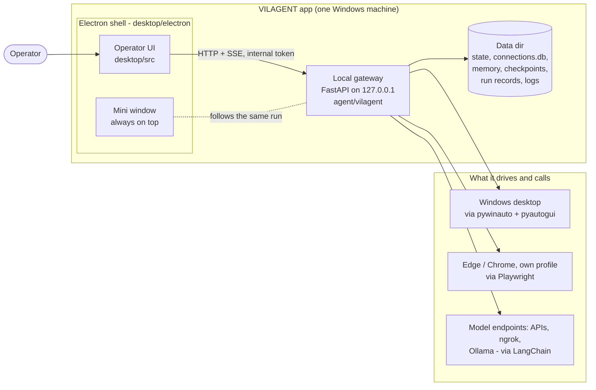

The gateway only listens on loopback and only accepts callers that carry the per-launch token the
launcher generated. Keys, memory and run records never leave the machine; the only outbound
traffic is to the model endpoints the operator configured (and whatever the browser task visits).

## 3. Processes and startup

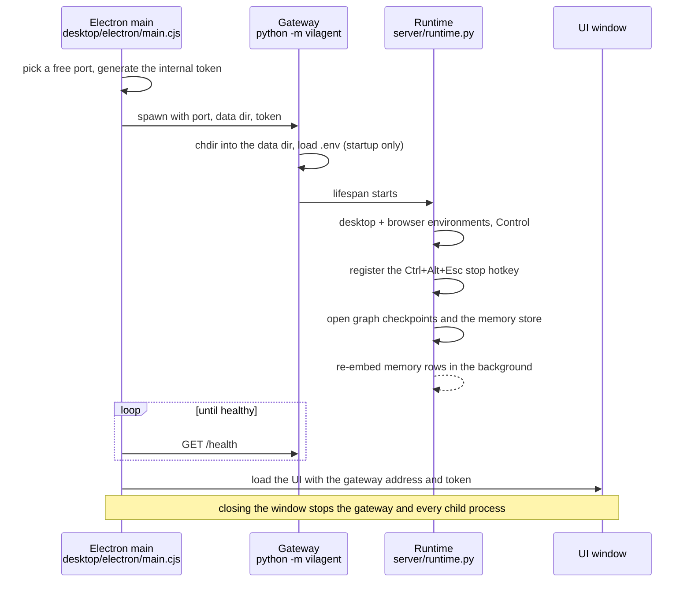

In development `corepack pnpm dev` does the same with `next dev` serving the UI; when packaged,
the gateway is a PyInstaller executable inside the Electron app.

## 4. Code layers

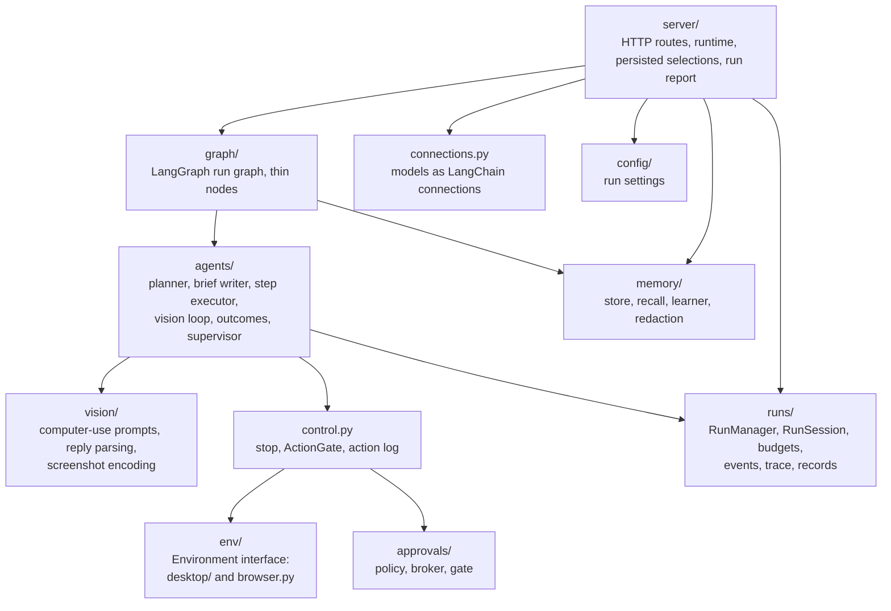

Rules that keep the layers clean:

- Agents talk to the **`Environment`** interface only (`screenshot()` + `act()`); the desktop and
  the browser are interchangeable and fully faked in tests.
- **Every action goes through `Control.perform`.** No code calls an environment's executor
  directly.
- The vision loop, the environments and `Control` **never import LangGraph**. Graph nodes stay thin
  and call plain functions.
- Graph state is **JSON only** (it is checkpointed); live objects (environments, models, callbacks)
  travel in `RunContext` (`graph/state.py`).

## 5. Life of a run

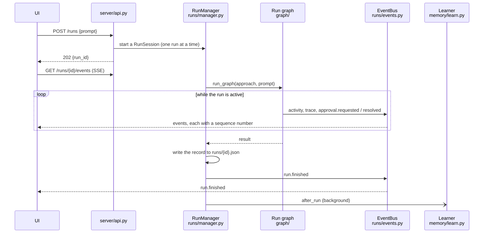

- A reconnecting client resumes from the last sequence number it saw; the bus keeps the last 2000
  events, which covers any reconnect within a run.
- Budgets (planner, vision and supervisor calls, actions, duration) are charged at the choke
  points through the session's context variable; running out ends the run with a clear reason.
- An **interrupted** run (the app closed mid-task) keeps its checkpoints and can be resumed from
  the step it was on; any other ending deletes them.

## 6. The run graph

The graph is built in `graph/build.py`; nodes are in `graph/nodes.py`.

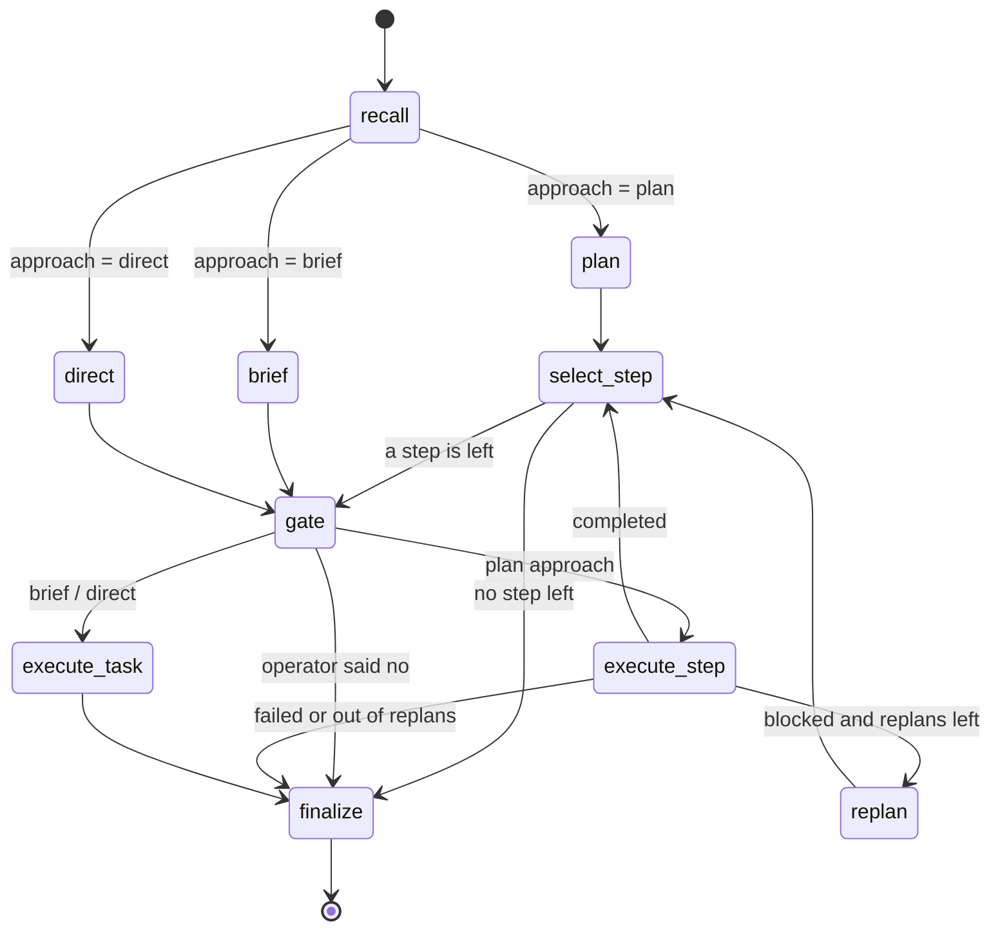

| Node | Does |
|---|---|
| `recall` | Reads memory once: similar past runs and lessons (section 11). |
| `plan` / `replan` | The planner writes (or revises) steps, each with a risk level and a completion criterion. |
| `brief` | The planner writes one directive and picks desktop or browser. |
| `direct` | The operator's words become the single step, unchanged. |
| `select_step` | Picks the next pending step. |
| `gate` | Asks the operator when the step's risk reaches the threshold: `interrupt()` pauses the graph until an answer arrives. |
| `execute_step` | One plan step through the step executor (section 7). |
| `execute_task` | The whole task in one vision loop (brief and direct). |
| `finalize` | Builds the outcome and the report. |

| Approach (`agents/common.APPROACHES`) | Planner calls | Steps |
|---|---|---|
| `plan` | plan + up to 2 replans | several, checked one by one |
| `brief` | one | one, the vision model owns the whole task |
| `direct` | none | one, the raw task |

Every node is wrapped by `traced()` so the UI sees it start and finish (section 12), and the graph
checkpoints to SQLite after each node, which is what makes resume possible.

## 7. Executing a step

`StepExecutor.execute` in `agents/plan_execute.py` decides how one plan step runs.

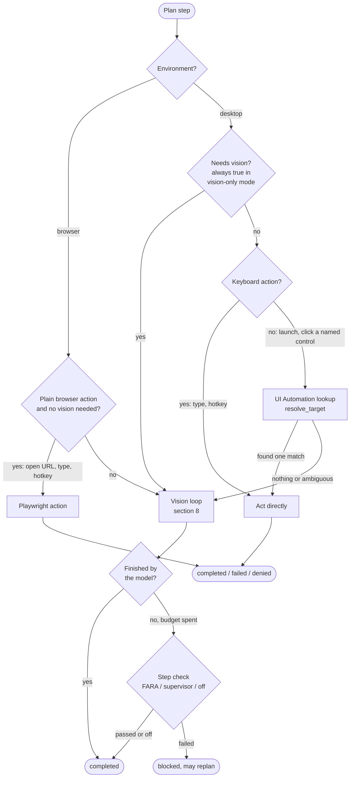

**Execution mode** (`hybrid` or `vision_only`) is chosen in the UI: hybrid tries native actions
first, vision-only sends every step to the vision loop (`prepare_plan`).

## 8. The vision loop

`run_vision_loop` in `agents/vision_loop.py` is shared by every approach and tuned with
`LoopLimits` (max actions, extra turns for waits, nudges, model errors, history length).

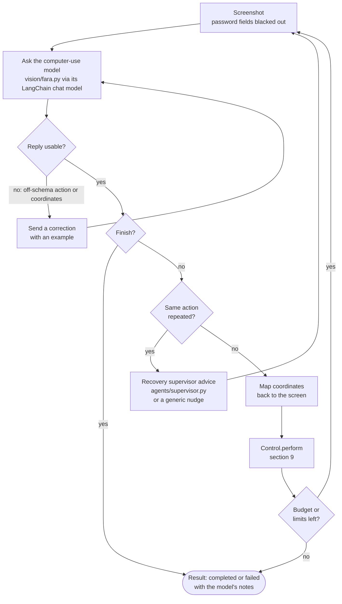

- A step is **completed only when the model says it finished**; running out of actions returns to
  the executor for a step check instead of counting as success.
- The model receives the step instruction, a short context hint, and up to two memory lessons for
  the step's app or site.
- Replies arrive in many spellings (`type_text`, `"640,380"`, `{x, y}`…); `vision/fara.py` maps
  them to the shared action vocabulary in `actions.py`.

## 9. Safety: one choke point

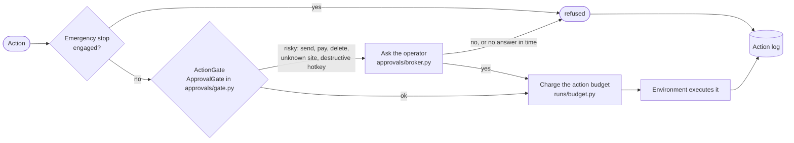

There are two levels of approval:

- **Steps**: the `gate` node pauses the graph when a planned step's risk reaches the operator's
  threshold (`off`, `critical`, `high`, `medium`).
- **Actions**: the `ActionGate` inside `Control.perform` catches risky individual actions, whatever
  the plan said, using words in the model's note, the target site and the hotkey.

A "no" ends the run and is never planned around. The stop button and the global `Ctrl+Alt+Esc`
hotkey engage the emergency stop: the running task is cancelled, further actions are refused and
the managed browser is closed.

## 10. Models as connections

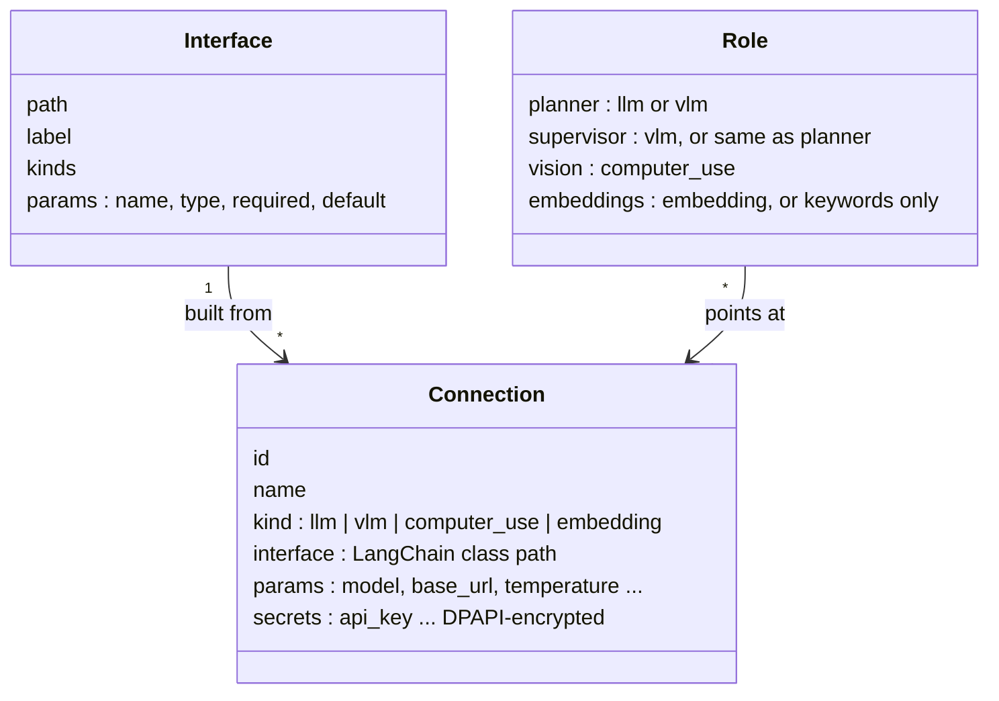

- `connections.INTERFACES` lists the LangChain classes the operator can pick (OpenAI-compatible,
  Ollama, Google Gemini, Anthropic Claude, and embeddings for OpenAI-compatible, Ollama, Gemini
  and Hugging Face) with each class's own constructor arguments under their real names.
- `connections.build()` imports the class and passes the stored arguments (secrets decrypted,
  empty ones falling back to the interface's defaults). Nothing in the app speaks HTTP to a model
  itself; an API, an ngrok tunnel and a local Ollama differ only in `base_url`.
- Connections live in `<data dir>/connections.db`. Secrets are encrypted with Windows DPAPI, so
  they only decrypt for the same user on the same machine, and the UI only ever learns which
  secrets are set.
- `server/models.py` maps each role to its connection (`ROLE_KINDS` says which types a role
  accepts) and offers a per-role connection check.

Adding a provider is one new `Interface` entry.

## 11. Experience memory

Memory lives in `<data dir>/.vilagent/memory.sqlite`: **episodes** (remembered runs), **lessons**
(learned advice and the operator's own notes, filed under an app, a site or "general"), full-text
indexes, and optional vectors from the embeddings connection.

### Writing, after a run

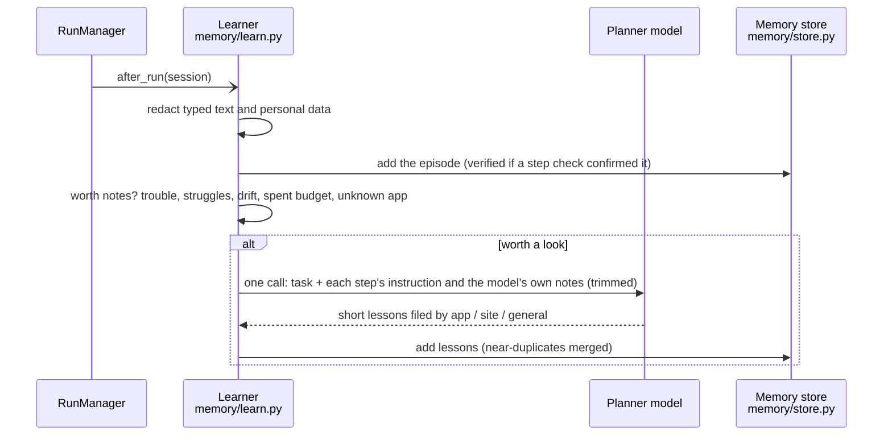

### Reading, before a run

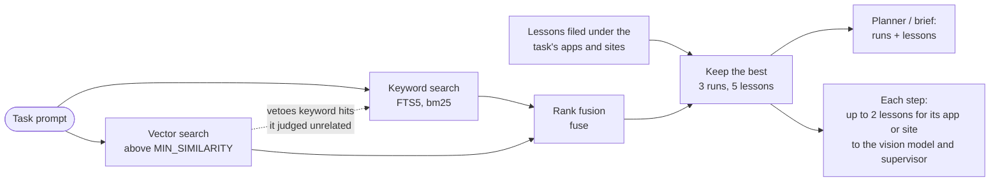

- `memory/retrieval.recall` runs once, in the `recall` node, and records which entries each run
  was given (the Memory panel's "Used in last run").
- The relevance floor means a task with nothing similar in memory gets nothing, not the least
  unrelated examples.
- Operator notes rank first; a run rated "bad" and a switched-off lesson are never recalled.
- Nothing typed and no screenshot is ever stored (`memory/redact.py`).

## 12. Live visibility

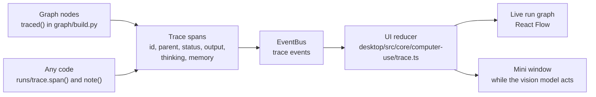

Traces are live only: they are never written to the run record, and typed text is masked before a
span is published. Budget snapshots (calls and tokens per model) ride on the `activity` event and
drive the usage counters in the UI.

## 13. Data and privacy

Everything the gateway writes lives in one data dir: the repository root in development,
`%APPDATA%\VILAGENT` when packaged.

| Path | Holds | Notes |
|---|---|---|
| `.env` | How the process starts (interpreter, host, port, data dir) | No keys |
| `.vilagent_state.json` | The operator's selections, each role's connection, and the `settings` block (budgets, approval rules, browser, log level) | Authoritative for a run |
| `connections.db` | Model connections | Secrets DPAPI-encrypted |
| `.vilagent/checkpoints.sqlite` | Graph checkpoints | Kept only for interrupted runs |
| `.vilagent/memory.sqlite` | Episodes, lessons, vectors | Redacted text only |
| `.vilagent/actions.jsonl` | Action log | Typed text masked |
| `runs/` | One JSON record per run | |
| `logs/` | Gateway, agent and UI logs, eval results | |

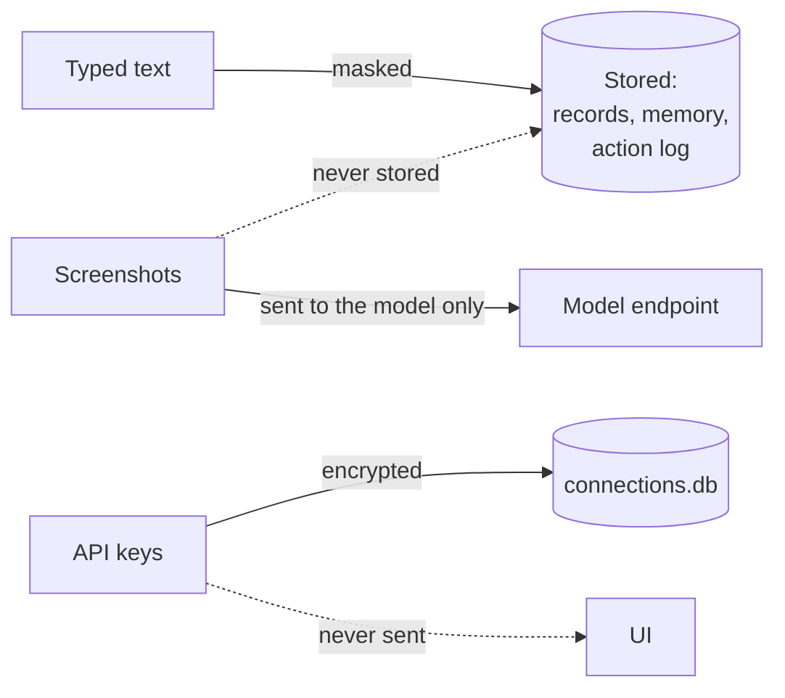

Stored data outlives the code: the state file, the connections database, memory and run records
all read shapes and names written by earlier versions and carry them over.

## 14. Extension points

| To add | Change |
|---|---|
| A model provider | One `Interface` entry in `connections.INTERFACES` (and its package in `agent/pyproject.toml` and `agent/vilagent-server.spec`) |
| An environment | A new `Environment` implementation in `env/` |
| A safety rule for actions | A check in `ApprovalGate` (`approvals/gate.py`), the `ActionGate` on `Control` |
| Different loop behaviour | `LoopLimits` values, not a second loop |
| New run behaviour | A thin node in `graph/nodes.py` that calls plain functions, wired in `graph/build.py` |
| Something visible in the UI's run graph | A `span()` around it and `note()` for its output |
